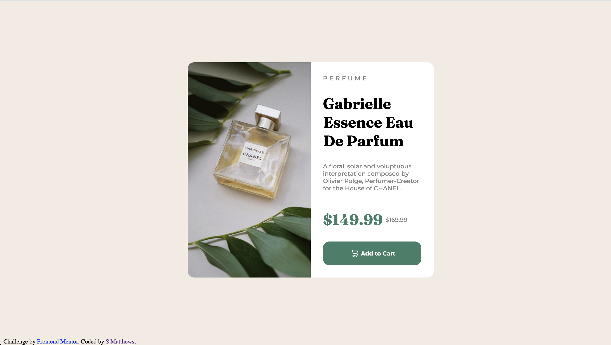

<!-- @format -->

# Frontend Mentor - Product preview card component solution

This is a solution to the [Product preview card component challenge on Frontend Mentor](https://www.frontendmentor.io/challenges/product-preview-card-component-GO7UmttRfa). Frontend Mentor challenges help you improve your coding skills by building realistic projects.

## Table of contents

- [Overview](#overview)
  - [The challenge](#the-challenge)
  - [Screenshot](#screenshot)
  - [Links](#links)
  - [Built with](#built-with)
  - [What I learned](#what-i-learned)
  - [Continued development](#continued-development)
- [Author](#author)

## Overview

This is my first project with Front End Mentor. I'm happy with the result alhtough I have really struggled to complete the mobile-design aspect of this project.

### The challenge

Users should be able to:

- View the optimal layout depending on their device's screen size
- See hover and focus states for interactive elements

### Screenshot

### Links

- Solution URL: [Add solution URL here](https://github.com/simonmatt89/FEM_product_preview_card.git)

### Built with

- Semantic HTML5 markup
- CSS custom properties
- Flexbox

**Note: These are just examples. Delete this note and replace the list above with your own choices**

### What I learned

I have learnt to place a main container in the cetre of the page and include to child dontainers which were placed side to side. I was happy with my use of felxbox when the dimensions of the browser changed.

### Continued development

I really tried to create the mobile-design but after 2-3 hours of searching the web for many soltuions, none of them worked. I think I may create a html/ css file for practise use where I could further explore this and use a template for future projects.

## Author

- Frontend Mentor - [@simonmatt89](https://www.frontendmentor.io/profile/simonmatt89)
